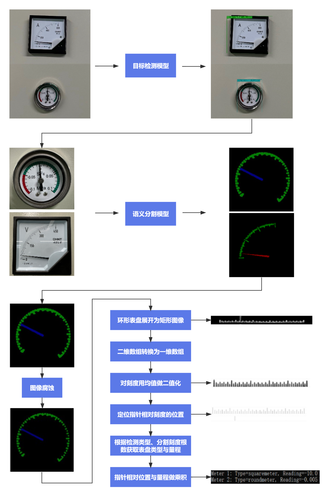
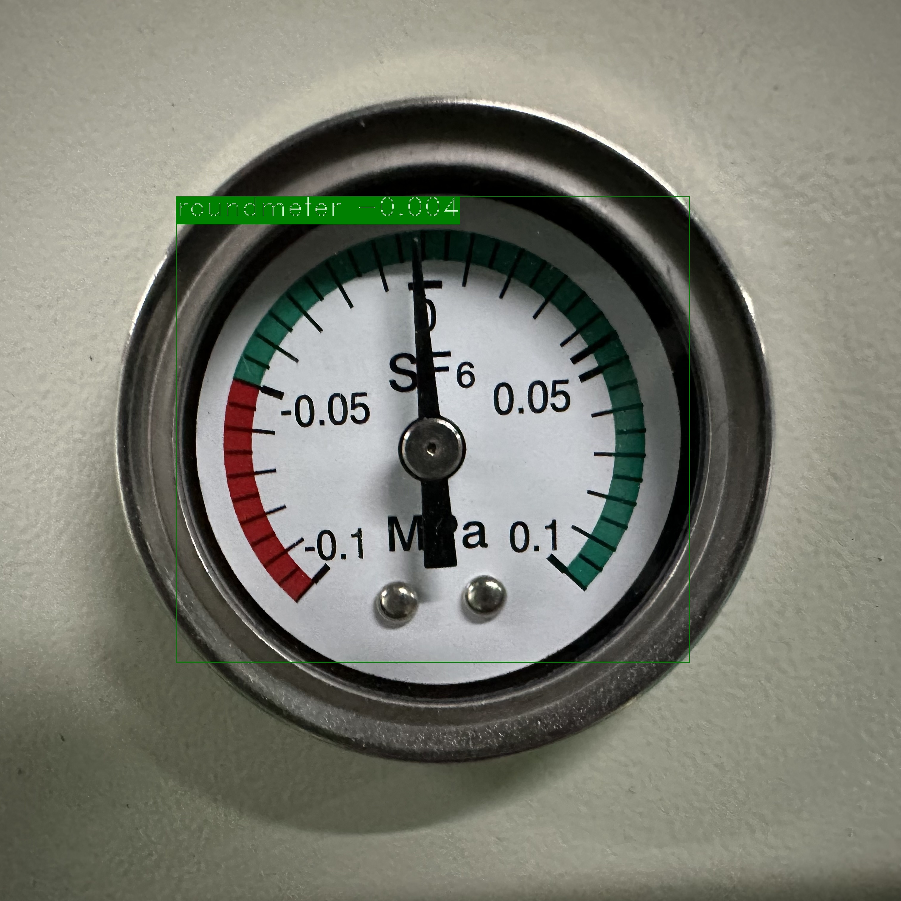
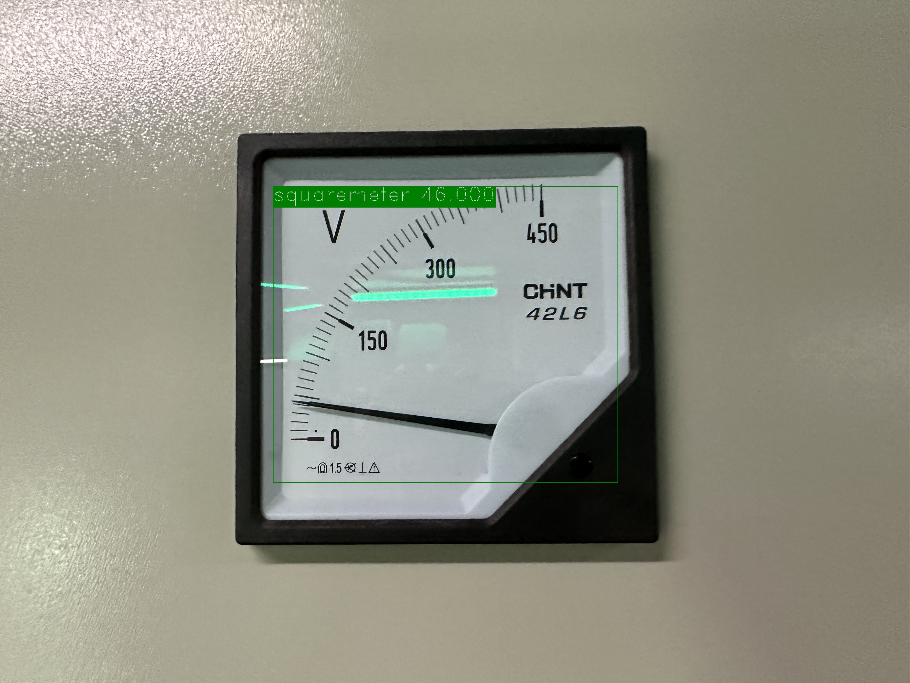

# 工业指针型表计读数

## <h2 id="1">1 项目说明</h2>

在电力能源厂区需要定期监测表计读数，以保证设备正常运行及厂区安全。但厂区分布分散，人工巡检耗时长，无法实时监测表计，且部分工作环境危险导致人工巡检无法触达。针对上述问题，希望通过摄像头拍照->智能读数的方式高效地完成此任务。

为实现智能读数，我们采取目标检测->语义分割->读数后处理的方案：

* 第一步，使用目标检测模型将表计按大类分类，并定位出图像中的表计；
* 第二步，使用语义分割模型将各表计的指针和刻度分割出来；
* 第三步，根据指针的相对位置和预知的量程计算出各表计的读数。

整个方案的流程如下所示：

<div align="center">
     
</div>


## <h2 id="2">2 数据准备</h2>

由于客观原因，数据采集量较少，本项目使用百度paddle的表计公开的表计检测数据集、指针和刻度分割数据集、表计测试图片（只有图片无真值标注）进行预训练并在此基础上加入自己的数据集,并使用进行 **Fine Tune**。所使用的公开数据集如下：

| 表计测试图片                                                 | 表计检测数据集                                               | 指针和刻度分割数据集                                         |
| ------------------------------------------------------------ | ------------------------------------------------------------ | ------------------------------------------------------------ |
| [meter_test](https://bj.bcebos.com/paddlex/examples/meter_reader/datasets/meter_test.tar.gz) | [meter_det](https://bj.bcebos.com/paddlex/examples/meter_reader/datasets/meter_det.tar.gz) | [meter_seg](https://bj.bcebos.com/paddlex/examples/meter_reader/datasets/meter_seg.tar.gz) |

* **Fine Tune** 使用的目标检测数据集的在项目中文件夹内容如下：

训练集有188张图片，测试集有21张图片。

```
dataset_det/
|-- annotations/ # 标注文件所在文件夹
|   |-- instance_train.json # 训练集标注文件
|   |-- instance_test.json # 测试集标注文件
|-- test/ # 测试图片所在文件夹
|   |-- 4.jpg # 测试集图片
|   |-- ... ...
|-- train/ # 训练图片所在文件夹
|   |-- 1.jpg # 训练集图片
|   |-- ... ...

```
* **Fine Tune** 使用的指针和刻度分割数据集的文件夹内容如下：

训练集有374张图片，测试集有40张图片。

```
dataset_seg/
|-- annotations/ # 标注文件所在文件夹
|   |-- train # 训练集标注图片所在文件夹
|   |   |-- 5.png
|   |   |-- ... ...
|   |-- val # 验证集合标注图片所在文件夹
|   |   |-- 6.png
|   |   |-- ... ...
|-- images/ # 图片所在文件夹
|   |-- train # 训练集图片
|   |   |-- 5.jpg
|   |   |-- ... ...
|   |-- val # 验证集图片
|   |   |-- 6.jpg
|   |   |-- ... ...
|-- labels.txt # 类别名列表
|-- train.txt # 训练集图片列表
|-- val.txt # 验证集图片列表

```

## <h2 id="3">3 模型选择</h2>

PaddleX提供了丰富的视觉模型，在目标检测中提供了RCNN和YOLO系列模型，在语义分割中提供了DeepLabV3P和BiSeNetV2等模型。

因最终部署场景是本地化的服务器GPU端，算力相对充足，因此在本项目中采用精度和预测性能皆优的PPYOLOV2进行表计检测。

考虑到指针和刻度均为细小区域，我们采用精度更优的DeepLabV3P进行指针和刻度的分割。

## <h2 id="4">4 表计检测模型训练</h2>

本项目中采用精度和预测性能的PPYOLOV2进行表计检测。具体代码请参考[train_detection.py](./train_detection.py)。

运行如下代码开始训练模型：

```shell
python train_detection.py
```
经过不断的参数调优，平衡数据集，迭代训练后，最优模型精度`bbox_mmap`达到99.81%：<br>
<br>
平均精准率均值`mAP`达到99.82%，混淆矩阵如下图所示：<br>


训练过程说明:

定义数据预处理 -> 定义数据集路径 -> 初始化模型 -> 模型训练

 * 定义数据预处理

```python
train_transforms = T.Compose([
    T.MixupImage(mixup_epoch=250), T.RandomDistort(),
    T.RandomExpand(im_padding_value=[123.675, 116.28, 103.53]), T.RandomCrop(),
    T.RandomHorizontalFlip(), T.BatchRandomResize(
        target_sizes=[320, 352, 384, 416, 448, 480, 512, 544, 576, 608],
        interp='RANDOM'), T.Normalize(
            mean=[0.485, 0.456, 0.406], std=[0.229, 0.224, 0.225])
])

eval_transforms = T.Compose([
    T.Resize(
        608, interp='CUBIC'), T.Normalize(
            mean=[0.485, 0.456, 0.406], std=[0.229, 0.224, 0.225])
])
```


 * 定义数据集路径

```python
train_dataset = pdx.datasets.CocoDetection(
    data_dir='dataset_det/train/',
    ann_file='meter_det/annotations/instance_train.json',
    transforms=train_transforms,
    shuffle=True)
eval_dataset = pdx.datasets.CocoDetection(
    data_dir='dataset_det/test/',
    ann_file='meter_det/annotations/instance_test.json',
    transforms=eval_transforms)
```

 * 初始化模型

```python
num_classes = len(train_dataset.labels)
model = pdx.det.PPYOLOv2(
    num_classes=num_classes, backbone='ResNet50_vd_dcn')

```

* 模型训练

```python
model.train(
    num_epochs=90,
    train_dataset=train_dataset,
    train_batch_size=16,
    eval_dataset=eval_dataset,
    pretrain_weights='meter_det_model',
    learning_rate=0.000125,
    warmup_steps=1,
    warmup_start_lr=0.0,
    lr_decay_epochs=[71, 80],
    lr_decay_gamma=0.1,
    save_interval_epochs=30,
    save_dir='output/ppyolov2_r50vd_dcn/exp1' ,
    use_vdl=True)
```

## <h2 id="5">5 指针和刻度分割模型训练</h2>

本项目中采用精度更优的DeepLabV3P进行指针和刻度的分割。具体代码请参考[train_segmentation.py](./train_segmentation.py)。

运行如下代码开始训练模型：

```shell
python train_segmentation.py
```
训练结束后，最优模型精度`miou`达84.09。<br>
<br>
平均精准率均值`mAcc`达到99.21%，混淆矩阵如下图所示：<br>


训练过程说明:

定义数据预处理 -> 定义数据集路径 -> 初始化模型 -> 模型训练

* 定义数据预处理

```python
train_transforms = T.Compose([
    T.Resize(target_size=512),
    T.RandomHorizontalFlip(),
    T.Normalize(
        mean=[0.5, 0.5, 0.5], std=[0.5, 0.5, 0.5]),
])

eval_transforms = T.Compose([
    T.Resize(target_size=512),
    T.Normalize(
        mean=[0.5, 0.5, 0.5], std=[0.5, 0.5, 0.5]),
])
```


* 定义数据集路径

```python
train_dataset = pdx.datasets.SegDataset(
    data_dir='dataset_seg',
    file_list='dataset_seg/train.txt',
    label_list='dataset_seg/labels.txt',
    transforms=train_transforms,
    shuffle=True)

eval_dataset = pdx.datasets.SegDataset(
    data_dir='dataset_seg',
    file_list='dataset_seg/val.txt',
    label_list='dataset_seg/labels.txt',
    transforms=eval_transforms,
    shuffle=False)
```

* 初始化模型

```python
num_classes = len(train_dataset.labels)
model = pdx.seg.DeepLabV3P(num_classes=num_classes, backbone='ResNet50_vd', use_mixed_loss=True)

```

* 模型训练

```python
model.train(
    num_epochs=90,
    train_dataset=train_dataset,
    train_batch_size=16,
    eval_dataset=eval_dataset,
    pretrain_weights='meter_seg_model',
    learning_rate=0.1,
    save_interval_epochs = 5,
    save_dir='output/deeplabv3p_r50vd/exp1',
    use_vdl=True)
```

## <h2 id="6">6 模型预测</h2>

运行如下代码：

```shell
python reader_infer.py --det_model_dir output/ppyolov2_r50vd_dcn/best_model --seg_model_dir output/deeplabv3p_r50vd/best_model/ --image meter_det/test/20190822_105.jpg
```

则会在终端上输出信息：

```
Meter 1: Type=squaremeter, Reading=-10.0
Meter 2: Type=roundmeter, Reading=-0.005
2023-08-03 15:04:55 [INFO]      The visualized result is saved at ./output/result\visualize_1691046295851.jpg
```
预测结果如下：

<div align="center">
<br>
              </div>


我们看下预测代码中的预测流程：

图像解码 -> 检测表计 -> 过滤检测框 -> 提取检测框所在图像区域 -> 图像缩放 -> 指针和刻度分割 -> 读数后处理 -> 打印读数 -> 可视化预测结果

```python
def predict(self,
            img_file,
            save_dir='./',
            use_erode=True,
            erode_kernel=3,
            score_threshold=0.5,
            seg_batch_size=2):

    """检测图像中的表盘，而后分割出各表盘中的指针和刻度，对分割结果进行读数后处理后得到各表盘的读数。

        参数：
            img_file (str)：待预测的图片路径。
            save_dir (str): 可视化结果的保存路径。
            use_erode (bool, optional): 是否对分割预测结果做图像腐蚀。默认值：True。
            erode_kernel (int, optional): 图像腐蚀的卷积核大小。默认值: 4。
            score_threshold (float, optional): 用于滤除检测框的置信度阈值。默认值：0.5。
            seg_batch_size (int, optional)：分割模型前向推理一次时输入表盘图像的批量大小。默认值为：2。
    """

    img = self.decode(img_file)
    det_results = self.detector.predict(img)
    filtered_results = self.filter_bboxes(det_results, score_threshold)
    sub_imgs = self.roi_crop(img, filtered_results)
    sub_imgs = self.resize(sub_imgs, METER_SHAPE)
    seg_results = self.seg_predict(self.segmenter, sub_imgs,
                                       seg_batch_size)
    seg_results = self.erode(seg_results, erode_kernel)
    meter_readings, meter_types = self.get_meter_reading(filtered_results, seg_results)
    self.print_meter_readings(meter_readings)
    self.visualize(img, filtered_results, meter_readings, meter_types, save_dir)

```

## <h2 id="7">7 模型导出</h2>

在训练过程中模型被保存在了`output`文件夹，此时模型格式还是动态图格式，需要导出成静态图格式才可以进行下一步部署。

运行如下命令将表计检测模型导出，会自动在`meter_det_model`文件夹下创建一个`inference_model`的文件夹，用来存放静态图格式的检测模型。

```python

paddlex --export_inference --model_dir=output/ppyolov2_r50vd_dcn/best_model --save_dir=meter_det_model

```

运行如下命令将刻度和指针分割模型导出，会自动在`meter_seg_model`文件夹下创建一个`inference_model`的文件夹，用来存放静态图格式的分割模型。

```python

paddlex --export_inference --model_dir=output/deeplabv3p_r50vd/best_model --save_dir=meter_seg_model
```
