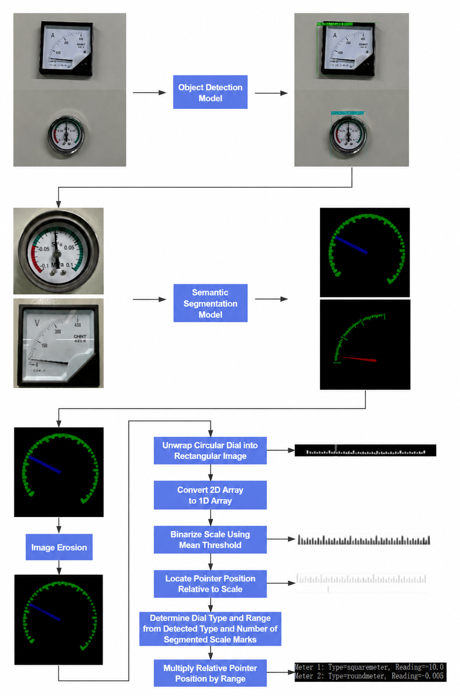
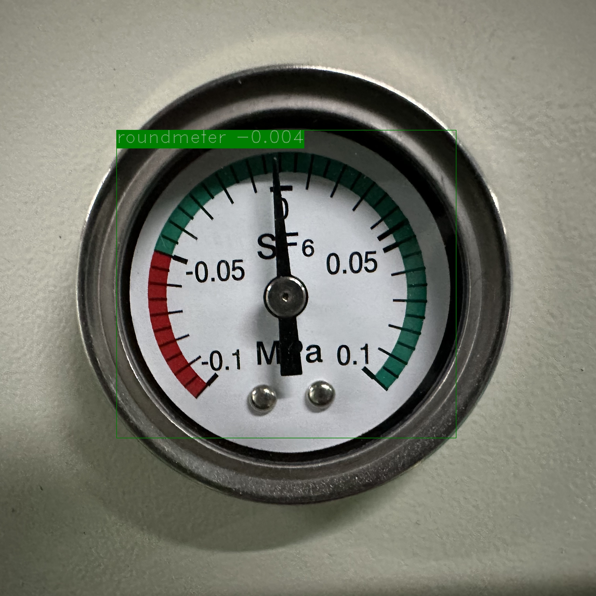
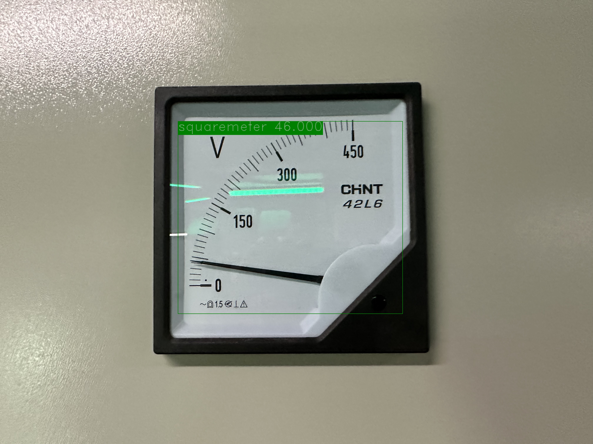

# Industrial Meter Reading via Image Processing

## 1. Project Overview

In power and energy plants, it's essential to regularly monitor meter readings to ensure equipment operates smoothly and to maintain safety. However, plant sites are often spread out, making manual inspections time-consuming and not always feasible in real-time. Moreover, some areas may pose dangers that prevent manual access. To address these challenges, we aim to efficiently complete this task by using a camera-to-smart reading system. This project enhances the PaddleX-based readmeter example.

Our approach involves three stages: target detection, semantic segmentation, and post-processing of readings:

- **First**, a target detection model categorizes and locates meters in images.
- **Second**, a semantic segmentation model identifies meter pointers and scales within each located meter.
- **Third**, the readings are calculated based on the relative positions of pointers using pre-known ranges.

The overall workflow is illustrated below:



## 2. Data Preparation

Due to limited data collection, this project utilizes publicly available datasets from Baidu Paddle for meter detection, pointer and scale segmentation, and test images (without annotations) for pre-training, followed by fine-tuning with our dataset. The datasets used are as follows:

| Test Images                                               | Detection Dataset                                        | Segmentation Dataset                                      |
| --------------------------------------------------------- | -------------------------------------------------------- | --------------------------------------------------------- |
| [meter_test](https://bj.bcebos.com/paddlex/examples/meter_reader/datasets/meter_test.tar.gz) | [meter_det](https://bj.bcebos.com/paddlex/examples/meter_reader/datasets/meter_det.tar.gz) | [meter_seg](https://bj.bcebos.com/paddlex/examples/meter_reader/datasets/meter_seg.tar.gz) |

### Fine-tuning details:

- **Detection Dataset Folder Structure:**

  - **Training set**: 188 images
  - **Test set**: 21 images

```plaintext
dataset_det/
|-- annotations/ # Annotation folder
|   |-- instance_train.json # Training set annotations
|   |-- instance_test.json # Test set annotations
|-- test/ # Test images folder
|   |-- 4.jpg
|   |-- ...
|-- train/ # Training images folder
|   |-- 1.jpg
|   |-- ...

```
- **Segmentation Dataset Folder Structure:**
- 
  - **Training set**: 374 images
  - **Test set**: 40 images

```
dataset_seg/
|-- annotations/ # Annotation folder
|   |-- train # Training set annotation images
|   |   |-- 5.png
|   |   |-- ...
|   |-- val # Validation set annotation images
|   |   |-- 6.png
|   |   |-- ...
|-- images/ # Images folder
|   |-- train # Training set images
|   |   |-- 5.jpg
|   |   |-- ...
|   |-- val # Validation set images
|   |   |-- 6.jpg
|   |   |-- ...
|-- labels.txt # List of class names
|-- train.txt # Training set image list
|-- val.txt # Validation set image list

```

## <h2 id="3">3 Model Selection</h2>

PaddleX offers a variety of vision models. For target detection, we use RCNN and YOLO series models. For semantic segmentation, models like DeepLabV3P and BiSeNetV2 are available.

Given the deployment scenario on local server GPUs with substantial computational power, we choose the PPYOLOV2 for meter detection due to its superior accuracy and performance.

For the fine-grained areas of pointers and scales, we opt for the high-precision DeepLabV3P for segmentation.

## <h2 id="4">4 Training the Meter Detection Model</h2>

The PPYOLOV2 model, known for its excellent accuracy and performance, is used for meter detection. Refer to train_detection.py for the detailed code.

Start the training by running the following command:

```shell
python train_detection.py
```
After several iterations of parameter tuning, balancing the dataset, and iterative training, the optimal model achieves a bbox_mmap accuracy of 99.81%：<br>
<br>
The average precision mean (mAP) reaches 99.82%, with the confusion matrix shown below:<br>


Training Process Details:

Define data preprocessing -> Define dataset path -> Initialize model -> Model training

 * Define Data Preprocessing

```python
train_transforms = T.Compose([
    T.MixupImage(mixup_epoch=250), T.RandomDistort(),
    T.RandomExpand(im_padding_value=[123.675, 116.28, 103.53]), T.RandomCrop(),
    T.RandomHorizontalFlip(), T.BatchRandomResize(
        target_sizes=[320, 352, 384, 416, 448, 480, 512, 544, 576, 608],
        interp='RANDOM'), T.Normalize(
            mean=[0.485, 0.456, 0.406], std=[0.229, 0.224, 0.225])
])

eval_transforms = T.Compose([
    T.Resize(
        608, interp='CUBIC'), T.Normalize(
            mean=[0.485, 0.456, 0.406], std=[0.229, 0.224, 0.225])
])
```


 * Defining the dataset path

```python
train_dataset = pdx.datasets.CocoDetection(
    data_dir='dataset_det/train/',
    ann_file='meter_det/annotations/instance_train.json',
    transforms=train_transforms,
    shuffle=True)
eval_dataset = pdx.datasets.CocoDetection(
    data_dir='dataset_det/test/',
    ann_file='meter_det/annotations/instance_test.json',
    transforms=eval_transforms)
```

 * Initialization Model

```python
num_classes = len(train_dataset.labels)
model = pdx.det.PPYOLOv2(
    num_classes=num_classes, backbone='ResNet50_vd_dcn')

```

* Model training

```python
model.train(
    num_epochs=90,
    train_dataset=train_dataset,
    train_batch_size=16,
    eval_dataset=eval_dataset,
    pretrain_weights='meter_det_model',
    learning_rate=0.000125,
    warmup_steps=1,
    warmup_start_lr=0.0,
    lr_decay_epochs=[71, 80],
    lr_decay_gamma=0.1,
    save_interval_epochs=30,
    save_dir='output/ppyolov2_r50vd_dcn/exp1' ,
    use_vdl=True)
```

## <h2 id="5">5 Pointer and scale segmentation model training</h2>

In this project, DeepLabV3P with better accuracy is used for pointer and scale segmentation. Please refer to [train_segmentation.py](. /train_segmentation.py).

Run the following code to start training the model:


```shell
python train_segmentation.py
```
At the end of training, the optimal model accuracy `miou` reaches 84.09.<br>
<br>
The average precision rate mean `mAcc` reached 99.21% and the confusion matrix is shown below:<br>


Description of the training process.

Define data preprocessing -> Define dataset path -> Initialize model -> Model training

* Define data preprocessing

```python
train_transforms = T.Compose([
    T.Resize(target_size=512),
    T.RandomHorizontalFlip(),
    T.Normalize(
        mean=[0.5, 0.5, 0.5], std=[0.5, 0.5, 0.5]),
])

eval_transforms = T.Compose([
    T.Resize(target_size=512),
    T.Normalize(
        mean=[0.5, 0.5, 0.5], std=[0.5, 0.5, 0.5]),
])
```


* Defining data set paths

```python
train_dataset = pdx.datasets.SegDataset(
    data_dir='dataset_seg',
    file_list='dataset_seg/train.txt',
    label_list='dataset_seg/labels.txt',
    transforms=train_transforms,
    shuffle=True)

eval_dataset = pdx.datasets.SegDataset(
    data_dir='dataset_seg',
    file_list='dataset_seg/val.txt',
    label_list='dataset_seg/labels.txt',
    transforms=eval_transforms,
    shuffle=False)
```

* Initialization model

```python
num_classes = len(train_dataset.labels)
model = pdx.seg.DeepLabV3P(num_classes=num_classes, backbone='ResNet50_vd', use_mixed_loss=True)

```

* Model training

```python
model.train(
    num_epochs=90,
    train_dataset=train_dataset,
    train_batch_size=16,
    eval_dataset=eval_dataset,
    pretrain_weights='meter_seg_model',
    learning_rate=0.1,
    save_interval_epochs = 5,
    save_dir='output/deeplabv3p_r50vd/exp1',
    use_vdl=True)
```

## <h2 id="6">6 **Model prediction**</h2>

Run the following code:

```shell
python reader_infer.py --det_model_dir output/ppyolov2_r50vd_dcn/best_model --seg_model_dir output/deeplabv3p_r50vd/best_model/ --image meter_det/test/20190822_105.jpg
```

Then a message will be output on the terminal:

```
Meter 1: Type=squaremeter, Reading=-10.0
Meter 2: Type=roundmeter, Reading=-0.005
2023-08-03 15:04:55 [INFO]      The visualized result is saved at ./output/result\visualize_1691046295851.jpg
```
The results of the projections are shown below:

<div align="center">
<br>
              </div>


Let's look at the prediction flow in the prediction code:

Image Decoding -> Detection Meter -> Filtering Detection Frames -> Extracting the region of the image where the detection frames are located -> Image Scaling -> Segmentation of Pointers and Scales -> Post-reading Processing -> Printing Readings -> Visualizing Prediction Results

```python
def predict(self,
            img_file,
            save_dir='./',
            use_erode=True,
            erode_kernel=3,
            score_threshold=0.5,
            seg_batch_size=2):

    """Detect the dials in the image, and then segment the pointers and scales in each dial, and get the readings of each dial after processing the readings of the segmentation result.

        Parameters:
            img_file (str): path of the image to be predicted.
            save_dir (str): path to save the visualization result.
            use_erode (bool, optional): if or not do image erode on the segmentation prediction result. Default: True.
            erode_kernel (int, optional): the size of the convolution kernel for image erosion. Default value: 4.
            score_threshold (float, optional): confidence threshold for filtering out detection frames. Default value: 0.5.
            seg_batch_size (int, optional): batch size of the input dial image when the segmentation model is forward reasoned once. Default value: 2.
    """

    img = self.decode(img_file)
    det_results = self.detector.predict(img)
    filtered_results = self.filter_bboxes(det_results, score_threshold)
    if not filtered_results:
        raise Exception("No meter is detected, please change another picture or view")
    sub_imgs = self.roi_crop(img, filtered_results)
    sub_imgs = self.resize(sub_imgs, METER_SHAPE)
    seg_results = self.seg_predict(self.segmenter, sub_imgs,
                                       seg_batch_size)
    seg_results = self.erode(seg_results, erode_kernel)
    meter_readings, meter_types = self.get_meter_reading(filtered_results, seg_results)
    self.print_meter_readings(meter_readings)
    self.visualize(img, filtered_results, meter_readings, meter_types, save_dir)

```

## <h2 id="7">7 Model Export</h2>

During the training process the model is saved in the `output` folder, at this point the model format is still in dynamic graph format, and needs to be exported to static graph format for the next deployment step.

Run the following command to export the meter detection model, it will automatically create a `inference_model` folder under the `meter_det_model` folder, which will be used to store the detection model in static graph format.

``python

paddlex --export_inference --model_dir=output/ppyolov2_r50vd_dcn/best_model --save_dir=meter_det_model

```

Running the following command to export the scale and pointer segmentation model will automatically create a folder `inference_model` under the `meter_seg_model` folder, which will be used to store the segmentation model in static graph format.

``python

paddlex --export_inference --model_dir=output/deeplabv3p_r50vd/best_model --save_dir=meter_seg_model
``
